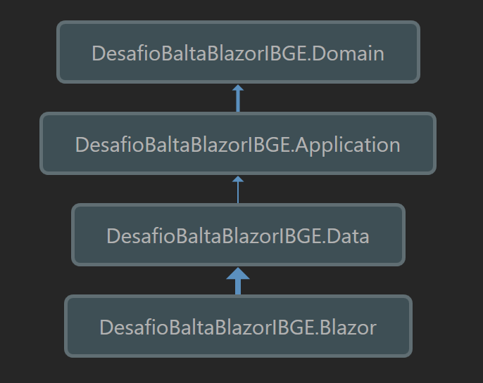

# Desafio Balta Blazor IBGE

Esse projeto tem como objetivo servir um front-end criado em Blazor 8 para trazer dados do IBGE sobre municípios e stados brasileiros.

## Instruções:
- Para usar as rotas de criação, edição e deleção de registros é necessário estar autenticado.
- A autenticação é realizada através de login e senha e é gerenciada através do Microsoft Identity.
- As rotas de busca são livres de autenticação.

## Como executar o projeto localmente:
- Realizar o git clone do projeto
- Editar a connection string no ``appsettings.json``.
- Rodar as migrations ``dotnet ef database update``.

## Arquitetura:
- Utilizamos arquitetura Clean Architecture para construção do projeto.

# Desenvolvedores:
[@jefersonquaiato](https://github.com/jefersonquaiato), [@teixeiralex](https://github.com/teixeiralex) e [@victorschlindwein](https://github.com/victorschlindwein)